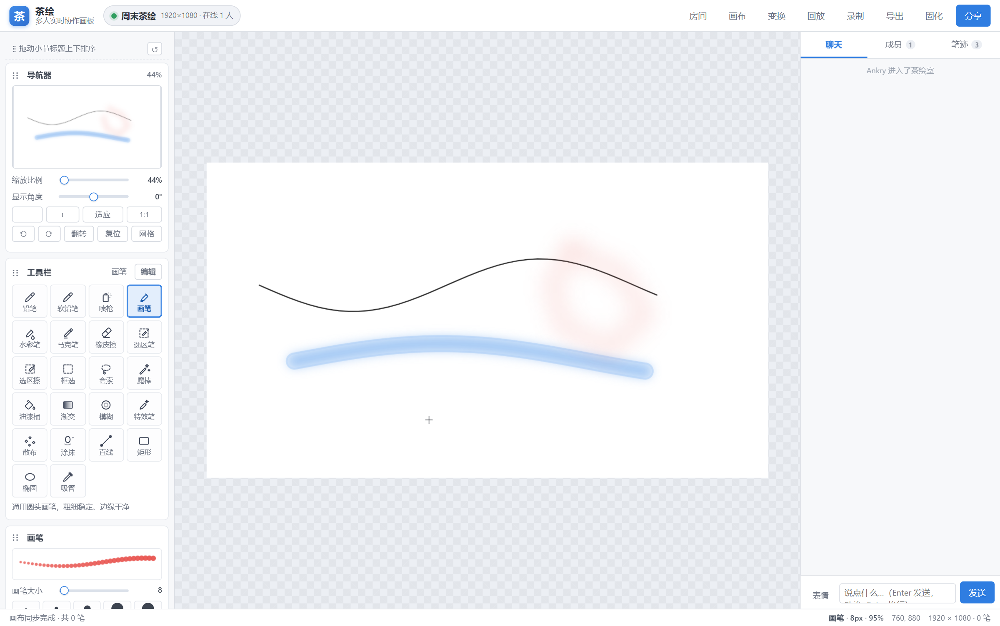
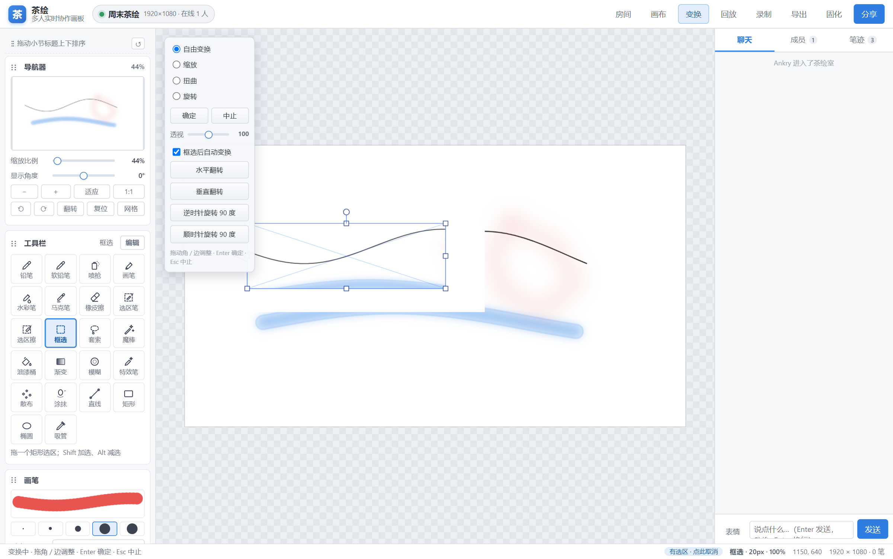
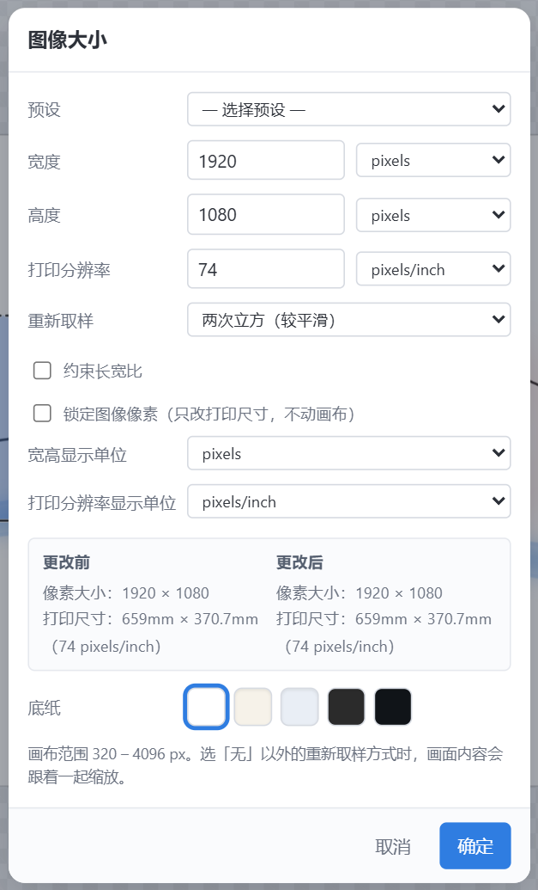
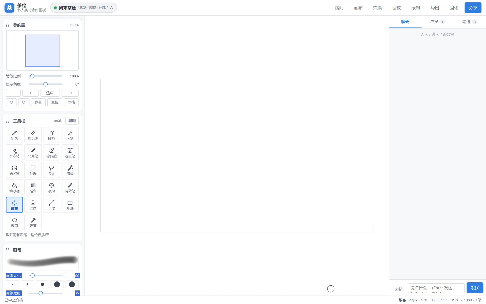

# 茶绘 · Chahui

> 多人实时协作绘画聊天室 —— 桌面端（Electron）+ 公网服务端（Node / WebSocket），笔刷与面板对照 PaintTool SAI Ver.2。

开一个房间，把链接发给朋友，大家就能在同一张纸上一起画，边画边聊。所有笔迹实时同步，
每台机器都用同一套确定性渲染，**两端像素级一致**。



---

## 功能

### 绘画
- **SAI2 风格笔刷体系**：铅笔 / 软铅笔 / 喷枪 / 画笔 / 水彩笔 / 马克笔 / 橡皮擦 / 特效笔 / 散布
- 每支笔独立控制 **大小、浓度、边缘硬度、最小直径、笔压→大小、笔压→浓度、抖动修正**
- **纸张质感**（无 / 细纹 / 粗纹 / 画布）与 **特殊效果**（水滴 / 噪点 / 散布）
- **17 种图层混合模式** + 图层不透明度 + **保护不透明度**
- 数位笔压感（笔压写进笔迹，所有端重放一致）
- 对称尺（垂直 / 水平 / 四向镜像）
- 油漆桶（色差范围 + 边缘扩大）、线性 / 径向渐变、涂抹、模糊
- 网格、画布旋转、水平翻转视图、1:1 / 适应窗口 / 滚轮缩放

### 选区
- **选区笔 / 选区擦**：像画笔一样涂出选区
- **框选 / 套索 / 魔棒**：矩形、自由圈选、按色差选中相连同色区域
- `Shift` 加选、`Alt` 减选，普通模式为「替换」
- 蚂蚁线提示；有选区时画笔只在选区内生效，画到区外会明确提示而不是「静默没反应」

### 图像变换


- **自由变换 / 缩放 / 扭曲 / 旋转**，4 角 + 4 边中点 + 旋转柄
- **透视**滑块、水平 / 垂直翻转、±90° 旋转
- 拖角时按整像素吸附网格线，所见即所得（预览与提交走同一套渲染代码）
- 结果由客户端烘焙成 PNG 回传，**另一端像素级同步**

### 画布与图层
- **图像大小**（对照 SAI2 的「画像解像度」）：宽 / 高（像素 / 百分比 / 厘米 / 毫米 / 英寸）、
  打印分辨率（pixels/inch 或 pixels/cm）、重新取样方式、约束长宽比、锁定图像像素、
  底部「更改前 / 更改后」实时对照像素大小与打印尺寸
- 图层新建 / 复制 / 清除 / 删除 / 上下移动 / 向下合并 / 合并可见 / 固化底图



### 协作
- 房间列表、密码房间、成员列表与在线状态
- 实时聊天 + **表情包**（内置 + 自定义图片）
- 远端光标
- **撤销 / 重做**（统一栈：笔迹、选区、变换都能撤）
- **回放**：把所有人的作画过程按时间轴回放，可调倍速
- **录制**：导出 WebM 视频
- **导出**：当前画面导出为 PNG
- 空房自动回收 + 一键清理

### 界面
- 左侧面板**可拖动排序**（整条小节标题都是把手），顺序记在本地
- 工具栏**可自定义**：拖动排序、收起 / 找回
- 圆形画笔光标（可选 智能 / 始终圆环 / 始终十字准星）
- 导航器：缩略图 + 取景框，可直接拖动平移

---

## 笔刷样张



---

## 快速开始

需要 **Node.js 18+**。

### 1. 起服务端

```bash
npm install --prefix server
npm run server          # 默认监听 0.0.0.0:8437
```

浏览器打开 `http://localhost:8437` 就能用网页版；同一局域网的其他人访问
`http://<你的内网 IP>:8437` 即可。

环境变量（都有默认值，一般不用管）：

| 变量 | 默认 | 说明 |
| --- | --- | --- |
| `PORT` | `8437` | 监听端口 |
| `HOST` | `0.0.0.0` | 监听地址 |
| `DATA_DIR` | `server/data/rooms` | 房间存档目录 |
| `MAX_ROOMS` | `400` | 房间数上限 |
| `MAX_LAYERS` | `16` | 单房间图层上限 |
| `MAX_MEMBERS` | `40` | 单房间人数上限 |
| `IDLE_ROOM_TTL` | `12h` | 有内容的房间闲置多久回收 |
| `EMPTY_ROOM_TTL` | `5min` | 空房（没人在线 + 一笔没画）多久回收 |

### 2. 桌面端

```bash
npm install --prefix client
npm run client          # 启动 Electron
```

### 3. 打包 Windows 安装包

```bash
npm install
npm run dist            # = 同步前端 + electron-builder --win --x64
```

产物在 `dist/`：`茶绘-安装程序-<版本>.exe`（NSIS 安装版）与 `茶绘-便携版-<版本>.exe`。

---

## 操作

| 操作 | 快捷键 |
| --- | --- |
| 撤销 / 重做 | `Ctrl+Z` / `Ctrl+Y`（或 `Ctrl+Shift+Z`） |
| 全选 / 取消选区 / 反选 | `Ctrl+A` / `Ctrl+D` / `Ctrl+I` |
| 变换（开始 / 确定） | `Ctrl+T`；变换中 `Enter` 确定、`Esc` 中止 |
| 新建图层 | `Ctrl+Shift+N` |
| 导出 PNG | `Ctrl+S` / `Ctrl+E` |
| 工具 | `B` 画笔 `E` 橡皮 `U` 模糊 `S` 涂抹 `L` 直线 `R` 矩形 `O` 椭圆 `G` 油漆桶 `N` 渐变 `Q` 选区笔 `W` 选区擦 `I` 吸管 |
| 笔刷大小 | `[` / `]` |
| 交换前景 / 背景色 | `X` |
| 平移画布 | 空格拖动，或中键拖动 |
| 临时吸管 | `Alt` 点击 |
| 缩放 | 滚轮 |
| 视图：翻转 / 旋转 / 适应窗口 / 1:1 | `H` / `,` `.` / `0` / `1` |

---

## 项目结构

```
茶绘软件/
├── shared/protocol.js       通信协议（唯一来源）
├── client/
│   ├── main.js              Electron 主进程
│   ├── preload.js
│   ├── build/icon.png       应用图标
│   └── renderer/            前端（Electron 与网页版共用同一套）
│       ├── index.html
│       ├── styles.css
│       ├── app.js           界面与交互
│       ├── engine.js        绘画引擎（图层、笔刷栅格化、撤销、回放、导出）
│       ├── transform.js     图像变换（网格插值 + 逐格解仿射）
│       ├── brushes.js       笔刷预设库
│       ├── net.js           WebSocket 客户端
│       └── protocol.js      ← 由 shared/protocol.js 同步而来
├── server/
│   ├── src/index.js         HTTP 静态托管 + /ws
│   ├── src/rooms.js         房间模型与持久化
│   ├── src/protocol.js      ← 由 shared/protocol.js 同步而来
│   ├── public/              ← 由 client/renderer 同步而来
│   └── data/rooms/          房间存档（运行期生成）
└── tools/                   同步、测试、验收、维护脚本
```

### ⚠️ 改代码前必读：三个「唯一来源」

1. **协议**只改 `shared/protocol.js`，然后 `node tools/sync-protocol.js`
   同步到 `server/src/protocol.js` 与 `client/renderer/protocol.js`。
2. **前端**只改 `client/renderer/`，然后 `node tools/sync-web.js` 同步到 `server/public/`。
   **漏这步网页版就是旧代码。**
3. 一条命令搞定：`npm run sync`。

改了协议还要**重启服务端进程**才生效（Node 已缓存模块）。

---

## 架构与关键设计

- **服务端只做「哑存储」**：图层级的像素操作（复制 / 向下合并 / 合并可见 / 固化底图 /
  图像变换 / 缩放画面）全部由客户端渲染成 PNG 回传，服务端只存 `baseImage` + `baseSeq`。
  统一入口是 `C2S.LAYER_PIXELS`。这样服务端永远不需要重放笔迹。
- **覆盖率蒙版渲染**：一笔先画进 scratch 蒙版再合成到图层，避免自交叠处反复加深（串珠）。
- **确定性随机**：散布、颗粒等随机性由笔迹携带的 `seed` + `mulberry32` 决定，任何端重放结果一致。
- **亚像素对齐**：本地取点也走协议量化（0.1px），否则与远端（收到的是量化点）出现亚像素差异，
  模糊 / 水彩边缘会把差异放大。
- **统一撤销栈**：笔迹、选区、像素操作按发生顺序排在同一个栈里，快照用 dataURL（PNG）而非 canvas，
  否则一张 4096×4096 的 canvas 就是 67 MB。
- **变换的源是「裁到选区」的小图**：翻转 / 90° 旋转在小图自己的坐标系里做，
  与变换框保持同一个相对变换，内容不会跑出选区。
- **实时预览整笔重画**：实时落笔若只补画新增段，批次之间是平头对接，
  抗锯齿会留下一圈淡缝（看起来就是「笔画断断续续」）。现在每次更新整笔重画，
  画中效果与松手后完全一致 —— 有 `npm run test:stroke` 守着这条。

---

## 开发与测试

```bash
npm run sync          # 同步协议 + 前端
npm run check         # CSS 括号配对 + 未定义函数扫描
npm test              # 双虚拟客户端端到端（不需要浏览器）
npm run test:browser  # Chrome 双上下文端到端（含两端像素比对）
npm run test:stroke   # 笔迹连续性回归
npm run verify        # 第一轮反馈验收（光标 / 图层清除 / 面板排序 / 分辨率 / 房间清理）
npm run verify2       # 第二轮反馈验收（选区语义 / 导航器 / 图像大小 / 图像变换 + 跨端同步）
npm run verify3       # 第三轮反馈验收（魔棒框选套索 / 自动变换 / 撤销 / 翻转不越界）
npm run brushes       # 笔刷客观量测（峰值浓度 / 边缘过渡带 / 沿线覆盖率）
npm run rooms         # 房间存档体检与清理
```

跑浏览器测试前先起服务端（默认 `http://localhost:8437`）。

> 判断「笔刷像不像 SAI2」请看 `npm run brushes` 的数字，不要盯缩略图 ——
> 缩略图上看不出的边缘硬度差异，数字一眼就能看出。

---

## 许可

[MIT](LICENSE)
