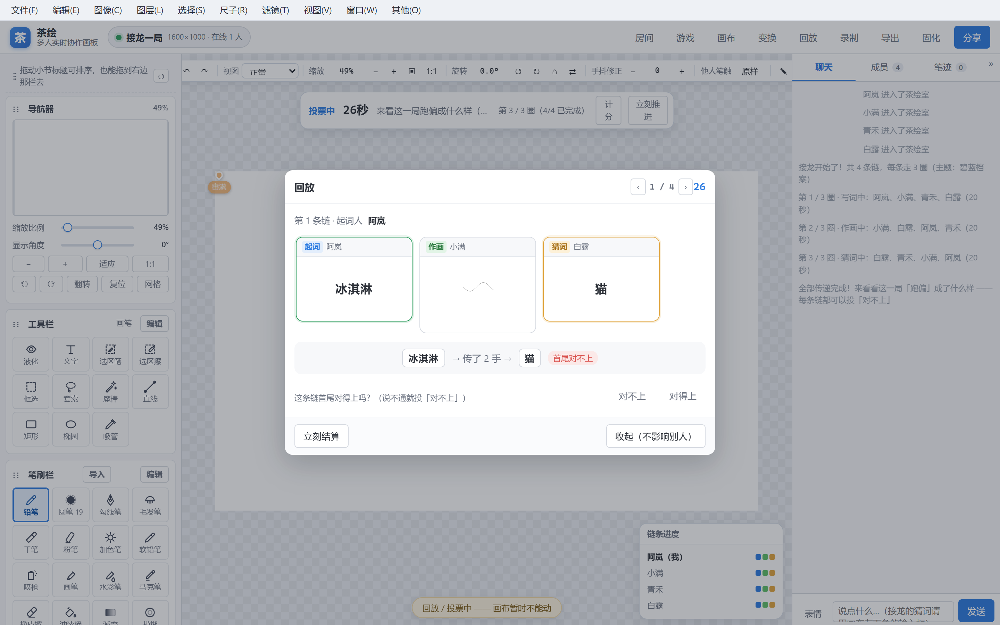
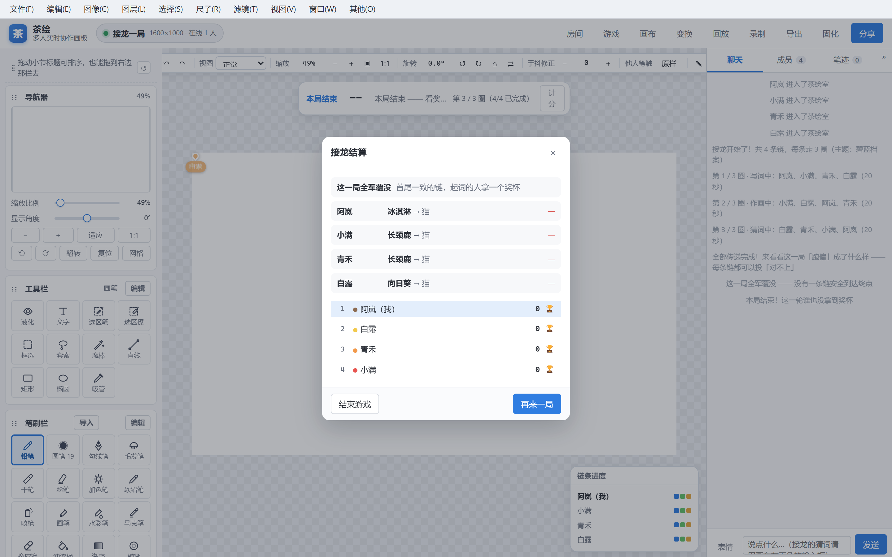
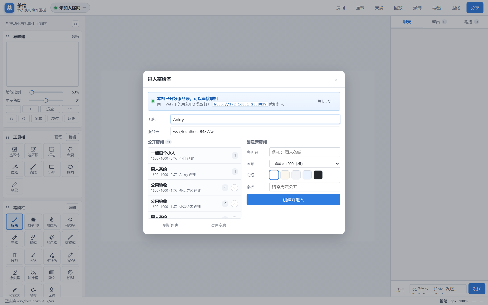

# 茶绘 · Chahui

> 多人实时协作绘画聊天室 —— 桌面端（Electron）+ 公网服务端（Node / WebSocket），笔刷与面板对照 PaintTool SAI Ver.2。

开一个房间，把链接发给朋友，大家就能在同一张纸上一起画，边画边聊。所有笔迹实时同步，
每台机器都用同一套确定性渲染，**两端像素级一致**。


📹 **[53 秒介绍视频](https://github.com/PainterAnkry/chahui/releases/download/v1.5.4/chahui-intro-1080p.mp4)**（1920×1080 · MP4）
—— 两部电脑、一张画布，朋友用浏览器打开地址就进来了。视频也是**脚本拍出来的**，
重做一遍只要 `npm run video:shoot && npm run video:build`，详见 [`video/README.md`](video/README.md)。

---

## 下载

不想自己编译的话，直接去 **[Releases](https://github.com/PainterAnkry/chahui/releases/latest)** 拿现成的
Windows x64 安装包：

| 文件 | 说明 |
| --- | --- |
| `chahui-setup-<版本>.exe` | 安装版，可自选目录、建桌面快捷方式 |
| `chahui-portable-<版本>.exe` | 免安装版，双击即用 |

装好之后**双击图标就能开房联机**（同一 WiFi 下的朋友用浏览器打开你那个地址即可）——
详见下面「最省事的用法」。想让**不同网络**的朋友也能进来，在 App 里点一下
**「开启公网联机」**就行（不用装任何额外软件），见「公网部署」。

装好之后想升级不用自己再来这儿找文件：「其他 → 关于 → 检查更新」会自己认出你这台机器该下哪个包并直接下载。

---

## 功能

### 绘画
- **笔刷栏 19 支笔**：铅笔、圆笔 19（PS 经典的 19 号圆头笔）、勾线笔、毛发笔、干笔、粉笔、加色笔、
  软铅笔、喷枪、画笔、水彩笔、马克笔、橡皮擦、油漆桶、渐变、模糊、特效笔、散布、涂抹
- **导入 Photoshop / Clip Studio Paint / Procreate 的笔刷**：直接吃 `.abr`、`.sut`、
  `.brush` 与 `.brushset`，把笔尖形状和相关参数搬进来（见下面「导入笔刷」）
- 每支笔独立控制 **大小、浓度、边缘硬度、最小直径、笔压→大小、笔压→浓度、抖动修正、混色**
- **铅笔带纸纹**（SAI2 的铅笔是有颗粒的，纯硬边会显得像画笔）
- **水彩笔有混色**（`mix`）：笔迹会和下面的颜色融合 —— 在红底上画蓝笔，出来的是紫调而不是纯蓝
- **纸张质感**（无 / 细纹 / 粗纹 / 画布）与 **特殊效果**（水滴 / 噪点 / 散布）
- **17 种图层混合模式** + 图层不透明度 + **保护不透明度**
- 数位笔压感（笔压写进笔迹，所有端重放一致）
- **尺子**（对照 SAI2 的五种形状）：直线尺 / 椭圆尺 / 平行线尺 / 同心圆尺 / 集中线尺 ——
  从「尺子」菜单选一种，在画布上拖一下摆好，之后的笔画自动吸附到尺子上；可显示 / 隐藏 / 重置
- 对称尺（垂直 / 水平 / 四向镜像）
- **网格变换**：拖网格上的控制点做局部变形，Alt 拖动会柔和带动周围
- **色调调整滤镜**：亮度 / 对比度 / 色相 / 饱和度，画布上直接预览
- **导出多种格式**：png / jpg / jpeg / webp / bmp / tga，以及**带图层和图层组的 PSD**
  （唯一一个不会把画面拍平的格式 —— 见下面「导出 PSD（含图层和图层组）」）
- **高斯模糊**：半径可调，预览即最终效果（四周按边缘像素延展，边缘不会被稀释成灰雾）
- **液化（小型）**：推着像素走 —— 拖到哪里，那一块的画面就朝拖动方向被推变形
- **文字工具 / 文字图层**：工具栏选「文字」→ 点画布定位置 → 输入文字 → 自动新建一个文字图层。
  文字作为**一种笔迹**走既有通道，所以能同步给别人、能一起撤销、能回放
- 油漆桶（色差范围 + 边缘扩大）、线性 / 径向渐变、涂抹、模糊 —— 都在笔刷栏里
- 网格、画布旋转、水平翻转视图、1:1 / 适应窗口 / 滚轮缩放

### 选区
- **选区笔 / 选区擦**：像画笔一样涂出选区
- **框选 / 套索 / 魔棒**：矩形、自由圈选、按色差选中相连同色区域
- `Shift` 加选、`Alt` 减选，普通模式为「替换」
- 蚂蚁线提示；有选区时画笔只在选区内生效，画到区外会明确提示而不是「静默没反应」

### 图像变换


- **自由变换 / 缩放 / 扭曲 / 旋转**，4 角 + 4 边中点 + 旋转柄
- **透视**滑块、水平 / 垂直翻转、±90° 旋转
- 拖角时按整像素吸附网格线，所见即所得（预览与提交走同一套渲染代码）
- 结果由客户端烘焙成 PNG 回传，**另一端像素级同步**

### 画布与图层
- **图像大小**（对照 SAI2 的「画像解像度」）：宽 / 高（像素 / 百分比 / 厘米 / 毫米 / 英寸）、
  打印分辨率（pixels/inch 或 pixels/cm）、重新取样方式、约束长宽比、锁定图像像素、
  底部「更改前 / 更改后」实时对照像素大小与打印尺寸
- **画布大小**：只改画布本身，**画面不缩放** —— 九宫格决定画面往哪边靠，
  多出来的地方是透明的、裁掉的就是没了；还有一颗「刚好装下内容」一键扩边
- **裁剪到选区**：画布直接变成选区那一块（和「画布大小」共用同一条管线）
- 图层新建 / 复制 / 清除 / 删除 / 上下移动 / 向下合并 / 合并可见 / 固化底图
- **图层组**：把几层打包成一个「组」，整组一起调**不透明度 / 混合模式**（17 种都行）。
  组那层参数对组内所有图层**只作用一次** —— 组设 50% 就是整组半透明，而不是「每层再各乘一遍 50%」
  （真按后者算的话，「组 50% + 组内 5 层」会淡成 3%，和按 50% 的直觉完全对不上）。
  面板上组行排在成员之上、成员缩进一格、组行显示「N 层」；
  **折叠箭头只收面板**（画布上照样显示，和 PS 一样），旁边那只眼睛才是真的隐藏整组。
  整组可以连着上下挪；组内图层只能在本组那一块里挪，想离开请用「进/出组」（点「上移 / 下移」想溜出去时会明说）。
  组行上两颗按钮**后果差得远所以不合并**：「解散」把图层留在原位（只是组那层浓度 / 混合模式会消失），
  「✕」连组里的图层一起删 —— 后者删到一层不剩会被服务端拒掉。
  组也存进 `.chahu`（**没有为此抬文件版本号**：老版本茶绘打开只是看不到分组，画面照样是对的）
- **图层蒙版**：给图层挂一张灰度蒙版（面板上那颗「蒙版」按钮）。
  **白 = 显示、黑 = 遮住**，用的是图层的不透明度通道 —— 和 Photoshop 一个语义，
  所以蒙版能原样进 PSD、也能从 PSD 读回来。
  关键是**非破坏**：涂黑只改「显示不显示」，**图层自己的像素一个字节都不动**（测试里每次都同时核对这两个数）。
  所以「关掉蒙版」和「删掉蒙版」都能让画面**完全**还原，撤销也照常工作。
  蒙版上可以直接用画笔涂（白笔露出来、黑笔遮掉），这些笔迹走的是**普通笔迹通道**
  （带一个 `target: 'mask'` 标记），于是同步、撤销、回放、中途进房的人重建蒙版 —— 全都是白拿的。
  **删蒙版会连带清掉那些蒙版笔迹**（不清的话，下一张新蒙版会被上一张的旧笔迹污染，
  中途进来的人重建出来的也会是错的 —— 这个毛病当时就是靠测试抓出来的）
- **剪贴蒙版**：勾上之后，这一层**只显示在紧挨着它下面那一层的不透明区域里**
  （是「下面那一层」，不是「下面所有层的累积」，和 SAI2 / PS 一致）。
  配合图层组，就是最常用的「上色层剪在草稿层上」那套画法
- **工程文件（`.chahu`）**：把画布尺寸 + 图层 + 每层的像素存成一个文件，换台机器接着画；
  另有**自动保存**，浏览器崩了 / 被强杀之后下次打开会问你要不要恢复（见下面「工程文件」）


### 编辑与剪贴板
- **拷贝**（`Ctrl+C`）：有选区就拷选区，没有就拷整幅。同时写进**系统剪贴板**和茶绘
  **内部剪贴板** —— 后者是拿不到系统权限时的退路（见下）
- **粘贴**（`Ctrl+V`，或「编辑 → 粘贴」）：把剪贴板里的图片贴成一个**新图层**，
  居中放好；比画布大的会**等比缩到刚好放得下**，缩了会在提示里告诉你缩成了多少。
  贴完新图层就是当前图层，`Ctrl+Z` 可以把这一层撤回成空的（图层的壳留着，想删再自己删）
- 图片来源三级兜底，因为三种运行环境的限制完全不一样：
  **① 桌面端**走主进程的 `clipboard.readImage()`（没有权限门槛，最稳）；
  **② 网页版**走 `navigator.clipboard.read()`（要浏览器授权）；
  **③ 兜底**是茶绘内部剪贴板，所以「在这儿拷、在这儿贴」**一定**能用。
  另外**右键 → 粘贴**那条原生路径也接了（走 `paste` 事件），且在输入框里粘贴文字时**一律不抢**
- 粘贴出来的是**独立图层**，和笔迹、文字一样参与同步 / 撤销 —— 别人立刻看得到，
  另一端看到的像素和你这块屏幕**逐像素一致**

### 协作
- 房间列表、密码房间、成员列表与在线状态
- **头像**：入口弹窗里「昵称」下面就能选一张图片当头像。本机会先**压到 96px** 再上传
  （优先 PNG 保透明；超 48KB 就退到 JPEG，退之前**先垫一层白底** —— 否则透明区域出来是黑块）。
  压好的头像跟着成员列表同步给同房间的人，聊天、成员列表、远端光标都显示它；
  **没设头像也不会空着**，退回「颜色 + 名字首字」那套老样子，任何一端看到的都是同一个。
  头像和昵称一样存在本机（`localStorage`），进房时随 `ROOM_CREATE` / `ROOM_JOIN` 带上去；
  已经在房里了再改，走 `member:avatar` 当场广播，**不用重进房**。
  为什么死磕 96px：头像会跟着**每一次**成员广播发给全房，40 人的房间要是每人一张 100KB 的图，
  一次广播就是 4MB —— 所以 48KB 这条上限是协议层的硬约束，超了会被服务端丢掉并给出提示
- **只读观众**：房主在成员列表里点一下某人右侧的「可画」→「观众」，那个人就只剩「看」的权限 ——
  能看见别人的笔迹、能聊天，但落笔 / 加图层 / 清空 / 变换 / 粘贴……**所有改画布的操作一律不落地**。
  拦的是**服务端**，不是把按钮置灰而已（前端那条只是提示，绕过去也没用）。
  本人顶栏会亮起「观众」标签、画布下方有一句说明，同一颗按钮随时恢复。
  两条边界：**正在作画的人不能当场变观众**（他手上那一笔会卡在半空，整局干等到超时）；
  观众也**不进画手池**（抽到了也没法画）——所以房间里只剩观众时开不了局。
  房主当然也可以把自己设成观众（把画板让给别人、自己只讲解），这条指令不走写操作闸门，随时能改回来
- 实时聊天 + **表情包**（内置 + 自定义图片）
- 远端光标
- **他人笔触淡化**：别人的笔迹在你这块屏幕上可以「淡一点 / 很淡 / 不显示」，
  画布上人多的时候一眼分清哪笔是自己画的。**纯本机显示**——不影响导出、不会同步给别人；
  也能在成员面板里单独设某一个人（比如「把那位大神的草稿藏起来」）。
  快捷键在画布上沿的快捷条上，或「窗口 → 他人笔触」
- **图层「只对我隐藏」**：图层条上第二只眼睛。跟同步的显示/隐藏分开 ——
  只在你这块屏幕上生效（看底稿用），别人那边不受影响，**导出也照样包含**
- **撤销 / 重做**（统一栈：笔迹、选区、变换都能撤）
- **回放**：把所有人的作画过程按时间轴回放，可调倍速（1× / 4× / 12× / 40×），拖进度条能来回看。
  **一笔一笔地长出来，不是一个一个蹦出来** —— 每笔的落点按它真实的作画时长摊开
  （`stroke:begin` 打 `ts`、收笔打 `te`），笔与笔之间的**真实停顿也保留**：
  作者停下来想了一会儿，回放里就是停了一会儿，嫌慢就调倍速。末帧与当前画面**逐像素一致**
  （开着洋葱皮时除外，见下条）。
  回放期间画布是**只读**的 —— 落笔一律不接收，免得手一抖在看回放时往共享文档里留下看不见的一笔
  （画面被回放盖着，画上去自己也看不见，事后谁都不知道是谁画的）
- **回放洋葱皮**：回放条上的「洋葱皮」（或「视图 → 回放洋葱皮」/ `Ctrl+Shift+K`）。
  把**刚画完的几笔染成暖色**、**马上要画的几笔染成冷色**叠在画面上，一眼看清运笔在往哪走、
  刚才那一笔落在哪儿，看别人的作画过程时特别有用。「前后几笔」可选 1 / 2 / 3 笔（越远越淡）。
  三点值得说明：
  · **纯本机显示** —— 不上传、不进文档、退出回放后画布上一点都不剩，和别人看到的东西无关
  · 残影**只染那几笔自己的墨迹**，不是把「上一帧整幅画面」叠上来：回放画面是不透明的（铺了背景），
    整幅叠上来只会把整张图压暗，看不出「哪几笔是刚出现的」
  · 开着导出回放视频会把残影一起录进去（录的就是当前画面），想要干净的成品视频就先关掉
- 回放条上会标出**「这一刻是谁在画」**（作者色圆点 + 名字）—— 人多的时候一眼看出哪段是谁的手笔；
  落在两笔之间的停顿时它会藏起来，因为那段时间画面本来就不动
- **一键导出回放视频**：回放条上的「导出视频」，或「文件 → 导出 → 导出回放视频」——
  按当前倍速从 0 播到底，全程录成一个 WebM 存下来，播完自动收工（再点一次可提前结束）。
  ⚠ 录的必须是**回放画面**：直接点顶栏那个「录制」录到的是**静止的完成图**（那个按钮录的是文档本身）
- **录制**：导出 WebM 视频
- **导出**：当前画面导出为 PNG
- 空房自动回收 + 一键清理
- **外网联机**：一条命令把本机服务端穿到公网（`npm run expose`），
  不同网络的朋友也能进来一起画 —— 见下面「公网部署」

> ⚠ 一个天然边界：笔迹一旦被 **固化底图 / 合并可见图层 / 变换 / 滤镜** 处理过，
> 那些像素就变成「图层底图」了，**再也分不出是谁画的**，只能整层隐藏。
> 所以「他人笔触」只对还没固化的笔迹生效。
>
> 「回放」也是同一条边界：它放的是**笔迹列表**（还留在内存/存档里的那些），
> 固化过的那部分会以「起始底图」的形式直接铺在回放画面底下，不参与逐笔生长。

### 你画我猜（联机小游戏）

房间里点顶栏的 **「游戏」**，房主可以就地开一局 —— 不用另开软件、不用切房间，玩完接着画。

> **一个面板开局（2026-09 合并）**：三个玩法（你画我猜 / 接龙 / 画皮）**共用同一张开局设置面板**。
> 点顶栏「游戏」→ 选玩法 → **下面参数区按玩法自动换** → 点一次「开始」直接进游戏。
> 以前接龙和画皮各自还有一层独立弹窗（要再点一次「进入大厅」），那一层已经删掉了。
>
> | 玩法 | 参数 |
> | --- | --- |
> | 你画我猜 | 主题词库 · 作画时间 · 回合数 · **换词次数** · **回合结算时间** |
> | 接龙 | 主题词库 · 作画时间 · 链长 · **写词时间** · **猜词时间** · **回放时间** · **投票时间** |
> | 画皮 | 主题词库 · 作画时间 · 轮数 · **夜晚时间** · **天亮时间** · **讨论时间** · **投票时间** |
>
> - 所有时间用下拉框，第一项标成「**默认（N 秒）**」，档位从 3 秒到 300 秒
> - **切玩法时通用参数（主题词库、作画时间）留着，玩法特有参数回到默认档**
> - **人数不够**：按钮直接写「还差 X 人」，点它会提示「需要 4~16 人」（按玩法给不同上下限）
> - **房主改设置，别人看得见**：房主在面板上动任何一项，服务端就把这份预设广播给全房
>   （`game:prefs`），其他人在自己面板里**只读**看到「房主设置的当前配置」
> - 游戏内倒计时带**阶段名**，例如「**投票中 12 秒**」——三个玩法所有阶段一致
> - 测试环境可以把所有时长压到 1 秒：给服务端加 `GAME_FAST=1`
>   （只压「默认层」，房主显式下发的秒数仍然优先；收格宽限、女巫决策窗口这类机制值不受影响）

- **怎么玩**：房主选回合数（默认 6 回）开局 → 系统轮着点名一个人当**画手**，
  给他 3 个词里挑一个（都不好画可以**换一组**，每回合 1 次，**次数可配**）→ 他有 80 秒把它画出来 →
  其他人**在聊天框里打答案**，猜对按名次给分（100 / 80 / 60 / 50 / 40），
  画手每被猜出一个人也得 20 分。
- **卡住了会有提示**：作画过半还没人猜出来，服务端自动**露一个字**
  （答案里随机挑一位，播报成「□猫□」），三个字以下的词不给 —— 露一个等于给一半。
- **回合结束**：所有人都猜对、或者时间到，就亮出答案、给一个回合结算小卡片，然后自动进入下一回。
- **算分与排名**：右侧记分板实时更新（可以用「分数」按钮收起来），打完整局弹排名。
- **中途进来的人先在旁边看**：开局之后才进房的人**这一回合只观战**，不占画手名额、也不会
  被忽然塞一个「该你画了」，顶栏会明写「本回合观战」；**下一回合自动转正**，跟大家一起玩。
  这样既不会因为「名单在开局那一刻就冻结了」把已经走完的回合顺序弄拧，也不用把新人踢出去
  等下一局 —— 他会收到一句系统提示，说明自己现在的状态。中途**退房**同理：不硬撑，
  该跳过的跳过，人不够就退回大厅等够人再开（两种玩法都是这套规则）。
- **全程有音效**：开局、轮到「你」、露字提示、倒计时 10 秒警告、最后 5 秒逐秒催促、
  猜对（自己 / 别人两套，不抢戏）、猜错、「很接近了」、回合结算、超时、整局排名 ——
  都是 **WebAudio 现场合成**（零音频文件，装包一个字节都没变大）。
  HUD 上的 **🔊** 一键静音，旁边的滑块调音量（**该音量记在本地**，静音状态下**连
  `AudioContext` 都不会被建出来**）。「猜错了」「很接近了」这类私信提示也各有一声，
  所以不用一直盯着聊天框。

几条「这类游戏能不能玩」的硬要求，都是在**服务端**保证的（不是前端把按钮禁掉那么简单）：

| 要求 | 做法 |
| --- | --- |
| **画手是谁、答案是什么，绝不能泄露给猜的人** | 答案只通过一条私有消息 `game:word` 单独发给画手；状态快照按人裁剪——猜手收到的 `word` 恒为空 |
| **只有画手能落笔** | 服务端 `canDraw()` 里检查游戏锁；猜手的笔迹 / 图层操作**直接被拒**，不是前端禁用 |
| **猜对的原文不能被广播出去**（否则等于泄题） | 游戏中的聊天被服务端截下。猜对 → 只广播「谁猜对了」；画手和已猜对的人说话 → 拦下并私信提醒 |
| **画歪了也能给点反馈** | 猜错但和答案只差 1 个编辑距离 → 私信一句「很接近了」（单字答案不判「接近」——那等于谎报） |
| **换回合必须换画布** | 回合开始清空笔迹，并把水位 `seq` 一起推进——否则会出现「画了看不见」（这是本项目的经典坑） |
| **没人选词 / 没人猜对 / 房主跑路都不能卡死** | 选词超时自动随机选一个；作画超时自动结算；房主退房时**房主自动转移**给房里剩下最早进来的人（否则「结束游戏」这类仅房主的操作就永久锁死了） |
| **中途进来的人不能被当成「开局时就在的人」** | 名单在开局那一刻冻结；之后进房的人进 `spectators` 观战集合 —— **不参与轮换、不会被抽成画手、也不算分**，快照里带 `spectating` 标记供前端显示提示条，**下一回合开始才转正**。中途退房的人从名单里跳过（最多绕两圈，不会死循环） |

> 词库（159 个中文词）只放在服务端 `server/src/words.js`，**不下发给浏览器** ——
> 想作弊也没得扒。`require` 时会自检：出现单字词（无论默认还是自定义）直接启动报错，
> 因为一个字的答案既猜不出来、「很接近了」还会对任何单字都误报。
>
> **想换成自己人爱画的词**（同事名、项目梗、方言…）：
>
> ```bash
> CHAHU_WORDS='长颈鹿,珍珠奶茶,加班,堵车' node server/src/index.js
> ```
>
> 游戏状态不写进房间存档 `room.json`：服务端重启后，房间会以「游戏已结束」的姿态回来。

### 接龙（绘画版「拷贝不走样」）



同一个「游戏」按钮里，把玩法切到 **「接龙」**就能开。需要 **4～16 人**同在房里。

- **怎么玩**：每人先给自己的链**想一个词**（也有系统给的候选，倒计时到点没写就**随机替他抽一个**，
  绝不会留下空格子）→ **自己先把这个词画出来**（第 0、1 两格都是链主）→ 画传给下一个人，
  他只能看图**猜一个词** → 猜出来的词再传给下一个人去**画**……一路传下去，直到走完链长
  （默认 **人数 + 1**：刚好人人轮到、谁也不重复）。
- **结算「公开处刑」**：全部传完 → **一条链一条链地**放：链 1 回放 → 所有人投票 → 亮这条链的结果
  → 链 2 回放 → …… 投票期间**全场看的是同一条链**（服务端指定，谁也翻不到别条去）。
  一条链 **√ 过半** → **起词的那个人拿一个奖杯**🏆。全部走完才是最终奖杯界面。
- **看画和投票都在主画布上**：要猜的那幅画直接铺在主画布区域，猜词输入条在主画布下方，
  画和输入框**同时看得见**（不再缩在左下角小窗里）。回放也一样走主画布，不弹遮罩挡着。
- **回放是逐格「翻」出来的**：一格一格揭晓，最后给出「起词 → 最后猜出来的词」的对照，
  下面就是「这两个匹配吗？」+ √ / ×，以及**已投 x / y** 的实时人数。
- **全程有音效**：开局的号角、轮到你、翻格、猜对、投票、拿奖杯 …… 都是
  **WebAudio 现场合成**（零音频文件，所以安装包不会因为加音效变大）。
  顶栏游戏 HUD 上的 **🔊** 一键静音，偏好存在本地。
- **房主可以催**：顶栏的「立刻推进」跳过没交的人；投票阶段直接结算 —— 有人挂了不用干等。
- **「结束游戏」当场销毁**：点下去**本地立刻**收掉所有接龙界面并回到主菜单，不等服务器回执 ——
  服务器就算没回应也不会被卡在游戏里。

接龙的保密是**整个玩法的死穴**，所以这几条也全在**服务端**兜底：

| 要求 | 做法 |
| --- | --- |
| **绝不能提前看到别人的词/画** | 题面走**单独一条私有消息** `game:task` 单发本人（`write`→候选词 / `draw`→**自己写的那个词** / `guess`→上家的笔迹）。快照 `snapshotFor()` 按收件人裁剪，**回放内容在投票开始前压根不下发** |
| **手里攥着答案的时候不能聊天** | 作画 / 猜词那两步的人发言会被服务端拦下并私信提醒 —— 否则一句剧透毁一条链 |
| **不是你的步骤就不能落笔** | 和「你画我猜」同一道锁：`canDraw()` 查 `lockedFor(userId)`，非当前步骤的人画布操作**直接被拒** |
| **有人掉线 / 挂机不能卡死** | 每步都有超时；写词那一步超时会**从他自己那三个候选里随机补一个**（起词永远非空），其余格子按空格子跳过，房主还能手动推进 |
| **一轮不能卡在原地** | 换格时清空画布并把 `seq` 水位一起推进（老坑：不抬水位就「画了看不见」） |
| **投票必须全场同一条链** | 串行投票由**服务端**用 `voteChainIndex` 指定当前链；`keepVote` / `favVote` 只接受当前链的票，投别的链直接被拒 —— 否则「串行」形同虚设 |

> **链长 = 每条链传几手**，默认 **人数 + 1**（第 0 格写词、第 1 格画自己的词，都是链主），
> 所以 4 人房的链是 `起词 → 画1 → 猜1 → 画2 → 猜2`。

> **主题词库（15 套）**：开局面板里可以挑 ——
> **通用**、**二次元混合（10 套 IP 去重合并的大杂烩）**、
> 以及按 IP 分的 **明日方舟 / 鸣潮 / 碧蓝档案 / 原神 / 崩坏：星穹铁道 /
> 明日方舟：终末地 / 东方 Project / 赛马娘 / 绝区零 / 怪物猎人**，
> 加上生活向的 **美食 / 动物世界 / 日常物品**。
> 词库和通用词库一样**只放服务端**，快照里只下发「有哪些主题、叫什么」，
> 一个词都不给，免得提前泄题。主题列表在 `GET /api/share` 与游戏快照两处都能拿到。

> **也能建自己的词库**：接龙面板「主题词库」那行有 **「管理…」**。
> 名字 + 若干个词（逗号 / 空格 / 换行随便分隔），存在**服务端**（全房间共用，重启还在）。
> 必须是 **2 个字以上的纯中文**，不合格的词**会在保存前就标出来**告诉你哪几个会被丢掉 ——
> 不静默吞词。谁新建 / 改了词库，所有房间的主题下拉会**当场刷新**（`game:themes` 广播）。
> 想直接改内置的：编辑 `server/src/themes.js`（那个文件有自检，写错服务端起不来）。

> 接龙状态同样**不写进存档**，重启后房间以「游戏已结束」回来（和经典模式一样的取舍）。



### 工程文件（`.chahu`）与自动保存
菜单「文件 → 保存工程（`.chahu`）」（`Ctrl+Alt+S`）把当前的画存成一个文件，
「文件 → 打开工程（`.chahu`）…」（`Ctrl+Shift+O`）把它读回来；入口页也有一颗「选择文件…」。
桌面端走系统保存 / 打开对话框，网页版就是普通的下载与文件选择。

**打开工程 = 新建一个房间来承载它，不是往当前房间里灌。**
茶绘的画布归房间所有、服务端是权威，往当前房间里灌会覆盖别人的画；
所以打开工程会先问一句，然后另开一个房间（当前房间的内容还在服务器上，不会丢）。

文件里存的是：

- 画布尺寸、背景，以及每一层的**名字 / 浓度 / 混合模式 / 可见性 / 锁定 / 保护不透明度**
- 每一层的**像素**（PNG）。空图层不存图，存 `null`
- **不存笔迹历史**。工程文件是「这份画现在的样子」，不是「它是怎么画出来的」——
  跨房间搬几千条笔迹要多传一个数量级的数据，而撤销栈本来就不跨会话。
  代价是装载完的房间里「笔迹」列表是空的（回放看不到这份内容）—— 这是取舍，不是 bug。

装载在协议上是**分片**的（`project:begin` / `project:layer` ×N / `project:end`）：
一层一条消息，多大的画都不会撞上 ws 单条 12MB 的上限；收不齐就整批丢弃、
房间保持原样，不会留下半个错位的图层表。

**自动保存**：画画期间每隔 25 秒（有改动才真去抓图）把同一份结构写进浏览器的 IndexedDB。
下次打开时，只有在「上次没正常结束」的情况下才会提示恢复：

> 判据是**草稿的写入时刻 vs 上次干净退出的时刻**（正常刷新 / 关页面时会同步记一笔到 localStorage）。
> 所以刷新页面不会弹提示（内容本来就在服务器上，弹了纯属噪音），
> 崩了 / 被强杀才会——那时这份草稿是你唯一的本地副本。
> 提示条上写清了是哪个房间、多大、几层、什么时候存的，可以「恢复」也可以「丢弃」。

> 已知边界：工程文件不带笔迹历史；图层数上限跟随服务端的 `MAX_LAYERS`（16），
> 超限的工程会**明确报错**，不会静默丢掉几层。

### 导出 PSD（含图层和图层组）

「文件 → 导出」里选 **Photoshop（.psd，含图层和组）**，出来的 `.psd` 用 PS / Krita / GIMP /
SAI 打开都是**一层一层的**，不是一张拍平的图 —— 名字、浓度、混合模式、隐藏状态、图层组
全都带过去，接着在 PS 里改就行。

- **这是唯一一个「不能拍平」的格式**。png / jpg / bmp / tga 那些都是把画面合成成一张位图再编码，
  图层结构在那一步就没了；PSD 要的是**文档结构本身**，所以编码器直接读引擎的图层树
  （`engine.renderLayerRaw()` 取每层**自己的像素**，不含层浓度与混合模式 —— 那两样由 PSD 自己算）。
- **格式是自己手写的**（`psd.js`，不引第三方库、装包不变大）：8BPS / 8 位 / RGB / **4 通道 RGBA**，
  通道数据用 PackBits（RLE）压。浏览器里跑得动，也方便钉死字节做回归。
- **组的语义对得上**：茶绘的组是「没有像素的合成单元，对成员只作用一次」，PSD 的组也是这样 ——
  一个组写成 `type=3` 边界分隔符 → 组内各层（自下而上）→ `type=1/2` 张开 / 收起分隔符，
  PS 那边的组不透明度 / 混合模式就是茶绘这边的组参数。
- **混合模式有映射表**：17 种一个不落（`add` → `lddg` 线性减淡、`multiply` → `mul `、
  `screen` → `scrn`、`overlay` → `over`……）。映射表在 `psd.js` 里，认不出的模式退到 `norm`，
  不会写出一个 PS 读不懂的块。
- **层名写两份**：PSD 那个老式的 Pascal 名字段只有 MacRoman 编码，中文写进去会变成 `?`，
  所以真名走 `luni` 块（UTF-16BE）。这样**老版本 PS 至少还能看到结构、新版本能看到中文名**。
- 图像尺寸沿用画布尺寸；导出的是**当前画面**（隐藏图层按 PSD 惯例照样写进去、只是标着隐藏，
  和「只对我隐藏」那种本机显示状态无关）。

> 验收不是靠肉眼打开：`tools/psd-lite.js` 是一个**项目自带的 PSD 解析器**，
> `node tools/test-psd.js` 会真的点一遍导出对话框、接住下载、再**逐字节**验回来 ——
> 版本号 / 通道数 / 位深 / 层名顺序 / 分隔符位置 / 混合模式 / 浓度 / 隐藏位 / 每层像素 /
> 合成图 40 个采样点，一条条钉死。另外还拿 `ag-psd` + `@napi-rs/canvas` 这类成熟库
> 交叉验证过一遍字节，确保 PS 系软件真读得进来。

### 导入 PSD（.psd / .psb 识别提示）

「文件 → 导入 PSD…」（`Ctrl+Alt+I`），选一个 `.psd`，茶绘会把它的**图层结构**读进来，
然后**新建一个房间**来承载它（当前房间不受影响，和打开工程文件那条路一样）。

- **这是导出的逆运算，而且真的做了回环验收**：测试里现造一份带蒙版 / 剪贴 / 图层组的文档
  → 导出成 PSD → 把那些字节**再喂回导入器** → 比对合成图**逐点一致**
  （`node tools/test-psd-import.js`，40 项）。PSD 是二进制格式，光断言「文件有几十 KB」等于没测；
  「导入」唯一说得通的验收标准就是**画面回来了**。
- 能读回来的东西：图层顺序、层名、不透明度、混合模式（17 种反向映射）、隐藏状态、
  **图层组**（`lsct` 3 → 组内各层 → 1/2 收尾）、**剪贴蒙版位**、**蒙版通道（通道 id `-2`）**。
- 蒙版是**灰度 → alpha** 的直接对应（`0 = 遮住、255 = 显示`），和茶绘自己的语义一样，
  **不需要反相** —— 这正是当初把蒙版实现成「不透明度通道」而不是「涂黑就抹掉像素」的回报。
- 通道数据支持**未压缩**与 **PackBits（RLE）**；位深支持 8 位和 16 位（16 位按高位截到 8 位）；
  颜色模式支持 RGB 和灰度（灰度会铺成 RGB）。
- 读不了的情况会**说人话**，而不是抛一个 JS 原生报错：PSB（大文档格式）、32 位/通道、
  CMYK / Lab、ZIP 压缩的通道、以及**被截断的文件**（「段长度对不上，是不是没下完？」）
  都会明确告诉你是哪一种、该怎么办。
- 解析器是 `psd-read.js`，同样**零依赖**手写；`tools/psd-lite.js` 是 Node 端那个更精简的版本，
  专门给测试用来拆字节。

### 导入笔刷（Photoshop `.abr` / Clip Studio Paint `.sut` / Procreate `.brush` `.brushset`）
笔刷栏标题上的 **「导入」** 按钮，选一个或多个 `.abr` / `.sut` / `.brush` / `.brushset` 文件，
弹窗里会列出解析到的每一支笔（带笔尖预览），勾选要的，确定即可 —— 它们会排到笔刷栏最后，
自动存进本地，下次打开还在。

- **Photoshop `.abr`**：支持新格式（v6 / v7 / v10，`8BIM` + `samp` 块）与旧格式（v1 / v2）。
  位图支持「原样」和 PackBits 两种压缩。
- **Clip Studio Paint `.sut`**：文件里嵌了一个 SQLite 库、笔尖是 PNG，直接按 PNG 签名扫出来。
- **Procreate `.brush` / `.brushset`**：`.brush` 是单支、`.brushset` 是一套（每支笔住一个子目录）。
  文件本身就是个 ZIP，里面 `Brush.archive` 是 Apple 二进制 plist，`Shape.png` 是笔尖形状图 ——
  所以浏览器里得自己解 ZIP（自己写的 DEFLATE）、读二进制 plist、解 PNG，**不依赖任何第三方库**。
  除笔尖外，能对应上的参数一并搬过来：间距、最小直径、压力→尺寸 / 压力→浓度、浓度上限、
  路径抖动（→ 抖动修正）、湿混（→ 混色）、颗粒粗细（→ 纸纹比例）。
  颗粒**位图**不搬 —— 茶绘的颗粒是内置程序化纸纹，和 Procreate 那张图不是一回事，
  只按「这支笔有没有颗粒」给一个中等偏轻的量。
  笔尖硬度是按**面积等效半径**推的（不是按径向环平均），所以 Marker 这类 2:1 斜切椭圆笔尖
  不会被误判成一坨软边。
- 导入的是**笔尖形状 + 这些参数**，不是把 PS / Procreate 的描边引擎搬过来。
- 笔尖会被压成 48×48 的 4 位灰度小图（约 1544 字符）**跟着每一笔一起同步**，
  所以**别人的屏幕上也能画出同样的笔触** —— 跨端像素一致这条没有被破坏。
- 笔刷栏里右键点导入的笔可以删掉它。

> 想删除某一支导入的笔：在笔刷栏里**右键**它。
>
> 解析器是「读不懂就明确报错」的：不认识的版本、没有 `samp` 块的 `.abr`、
> 扫不到 PNG 的 `.sut`、不是 ZIP 或里面没有 `Brush.archive` 的 Procreate 文件，
> 都会弹一句人话，不会静默给你一支错的笔。
>
> **验证情况**：`npm run abr:corpus <目录>` 会拿一个目录里的真实 `.abr` 挨个过一遍。
> 当前在 17 个真实商用笔刷文件（共 **998 支笔**，版本 v6 与 v10、次版本 1/2、
> 原样与 PackBits 两种压缩）上 **17/17 全部解析成功**。
> Procreate 有 2 个**真实**文件进了仓库（`tools/procreate-corpus/`），
> `node tools/procreate-corpus.js` 会锁住它们的每一个字节（ZIP 大小、PNG 灰度校验和、
> 映射出的参数），`npm run test:import` 再把它们从真实的「导入」按钮灌一遍。
> `.sut` 还没有真实文件可测，只用构造样本验证过 —— 遇到打不开的把文件名发我。

### 界面
- **菜单栏按 SAI2 的真实菜单做**：文件 / 编辑 / 图像 / 图层 / 选择 / 尺子 / 滤镜 / 视图 / 窗口 / 其他，
  共 146 项 —— 带助记键（`新建(N)`）、▸ 子菜单、☑ 勾选项；
  **茶绘还没有的功能照样列出来但置灰**，一眼能看出「哪些是我没找到、哪些是还没有」
- **快捷键可以改**：「其他 → 快捷键设置…」里点一行按一下就行，改完立刻生效、下次打开还在；
  和别的功能撞键会当场提示并把对方清空，「全部恢复默认」一键还原
- **工具栏和笔刷栏分成两栏**（对照 SAI2）：工具栏放「选区 / 形状 / 吸管」，笔刷栏放所有「下笔涂东西」的工具
  （油漆桶 / 渐变 / 模糊 / 涂抹也在这边）；两栏各自可编辑（◀ ▶ 调顺序、✕ 收起），且都能跟着小节标题一起拖动排序
- 左侧面板**可拖动排序**（整条小节标题都是把手），顺序记在本地
- **小节可以拖到右栏去**：把「颜色」「图层」这种小节从标题栏拖到右边（或拖回左边）都行，
  左右各自排序、各自记住 —— 空着的那一栏会自动收起来，不白占地方；
  拖乱了用「窗口 → 恢复默认面板布局」一键还原
- **颜色栏**（对照 SAI2）：
  - 前景 / 背景两个色块并排（按 `X` 互换，背景也能单独点开改），不再是一个看不见的状态
  - 顶部一排开关可以分别显示 / 隐藏「色轮 / RGB / HSV / 色板」，状态记在本地
  - 色轮：色环取色相、里面的三角取明度 / 饱和度；按住 `Shift` 色相每 15° 吸一档。
    点三角绝不会改到色相，三角和色环之间也没有「点了没反应」的死角
  - RGB 与 HSV 都是滑块 + 数字框双向输入，数字框能用 `↑` `↓` 微调（配合 `Shift` 一次 10）、
    也能用鼠标滚轮拨
  - 色板可以自己加：`＋ 加入色板` 把当前色存进去（右键色格删掉，`恢复默认` 清空），记在本地
  - 「最近使用」有标题和清空按钮，换色快的时候点一下就回去，记在本地
  - `X` 前景 / 背景互换、`D` 回到「前景黑 / 背景白」（和 PS、Krita 一样）
  - 十六进制框点进去就是全选，支持 `#abc` 简写和不带 `#` 的写法
- 工具栏**可自定义**：拖动排序、收起 / 找回
- **「其他 → 关于」里能直接更新**：读 GitHub 的最新 release 和当前版本比。有新版本时它
  **自己认出这台机器该下哪个包**（Windows 优先安装版、其次便携版；Mac 认 `dmg`；Linux 认
  `AppImage` / `tar.gz` / `deb`），点名显示文件名与体积，点一下就开始下载 ——
  **不会把你丢到 GitHub 页面自己挑文件**（那一步正是最容易下错的地方：便携版 / 安装包 / 源码 zip
  混在一起）。桌面端由主进程下载（渲染进程抓跨域的 GitHub 资产会被 CORS 挡掉）并直接拉起安装程序；
  网页版抓成 blob 再存，同样不跳页。直连 GitHub 不通时自动改走镜像下载，并在提示里说明。
  release 里要是没有认得出的安装包，它会老实给一个 Releases 入口，而不是假装能一键下
- 圆形画笔光标（可选 智能 / 始终圆环 / 始终十字准星）；框选 / 套索 / 魔棒自动用十字准星
- 导航器：缩略图 + 取景框，可直接拖动平移
- **参考图**是独立浮窗（像 PS 打开一张图那样），可拖、可缩放、可调不透明度，只有自己看得见

---

## 笔刷样张


---

## 快速开始

需要 **Node.js 18+**（只玩桌面版的话不需要 —— 见下面「最省事的用法」）。

### 最省事的用法：双击 exe

装好桌面版之后，**双击图标就能用，不用另外装 Node、也不用单独起服务端** ——
客户端里内置了一个服务器，开程序时它会自己起来（默认 8437 端口）：

1. 双击「茶绘」
2. 入口弹窗顶部会显示 **本机已开好服务器**，以及一条局域网地址（形如 `http://192.168.1.23:8437`）
   —— 顺手在「昵称」下面挑一张**头像**（本机会自动压到 96px 再同步给房里的人）
3. 创建房间，点「分享」或「复制地址」把那条链接发给同一个 WiFi 下的朋友
4. 朋友**用浏览器打开那个链接**就能进来一起画（他们什么都不用装）



> 这条链路的前提是大家在**同一个局域网**（同一个 WiFi / 同一个路由器）。
> 想让身处不同网络的朋友加入，需要一台公网服务器，见下面的「公网部署」。

#### 入口页那颗开关：在线 / 离线一个按钮切

入口弹窗的「服务器」下面有一行 **离线模式**（只有桌面端有，网页版会整行藏起来）。
按钮上写的是**你现在能做的事**，右边小字才写现在是什么样：

| 按钮 | 什么时候出现 | 点下去 |
| --- | --- | --- |
| **切到离线** | 服务器开着、你也在线 | 你自己断开，自己单机画 |
| **连回服务器** | 服务器开着、你在离线档 | 连回本机服务器，回到联机 |
| **开启服务器** | 这台机器还没开服务器 | 起一个服务器并连上去 |

菜单里也有一条 **其他 → 离线模式（自己单机画）**，前面带 ✓ 表示你现在在离线档。

> **「离线」不停服务器。** 这是这块设计的关键：桌面端的服务器同时是这台机器的
> 「房间存档 + 网页版入口」，停掉端口对单机画画没有任何好处，却会把正画着的朋友
> 一脚踢出去，还要处理「端口刚释放没凉透」的重开时序（`close()` 过的
> WebSocketServer 是终态，得整个重建）。所以「离线」= **你这个人离线**：
> 你自己不联网，服务器照旧在后台跑，同一 WiFi 的人仍然能从那个地址进来。
> 真要把端口也停掉是独立运行服务端的场景（`node server/src/index.js`），
> 服务端那边有 `stopListening()`，桌面端刻意不暴露它。

那离线之后还能画吗？能，靠的是**离线模式**：主进程里挂一个**不走 socket 的客户端**
（`client/local-host.js`），直接调用服务端那份 `onClient()`。也就是说
**在线和离线共用同一个房间状态机** —— 离线不是另写一套，所以不会出现
「在线能画、离线某些按钮没反应」这种两套逻辑慢慢分家的毛病。

具体到实现上，网络层只有两条通道、同一个收包出口：

| 通道 | 是什么 | 什么时候用 |
| --- | --- | --- |
| `ws://…` | 普通 WebSocket | 网页版、连别人的服务器、连公网、桌面端连本机 |
| `local://` | 进程内的假地址（**不占端口、不出网**） | 桌面端切到离线档之后 |

所以「离线模式」在代码里就是一个 `local://` 的地址，别的什么都没变 ——
消息还是那些消息，只是不经过网络。切档时会把旧的那条连接真的关掉
（不然新通道起来了、旧 socket 还原地挂在服务端的房间里，等于一个人占两个座位），
房间存档不受影响；切回在线时是**新开一条连接**，服务端的房间状态机一直是同一份。

> 内置服务器也可以设成不开机自启：配置文件 `<用户数据目录>/chahu-config.json` 里设
> `"embeddedServer": false`。那种情况下按钮会写「开启服务器」，点一下才真的起一个。

### 网页版 / 自建服务端

```bash
npm install --prefix server
npm run server          # 默认监听 0.0.0.0:8437
```

浏览器打开 `http://localhost:8437` 就能用网页版；同一局域网的其他人访问
`http://<你的内网 IP>:8437` 即可。

环境变量（都有默认值，一般不用管）：

| 变量 | 默认 | 说明 |
| --- | --- | --- |
| `PORT` | `8437` | 监听端口 |
| `HOST` | `0.0.0.0` | 监听地址 |
| `DATA_DIR` | `server/data/rooms` | 房间存档目录 |
| `PUBLIC_DIR` | `server/public` | 静态资源目录（桌面端内置时指向 renderer） |
| `MAX_ROOMS` | `400` | 房间数上限 |
| `MAX_LAYERS` | `16` | 单房间图层上限 |
| `MAX_MEMBERS` | `40` | 单房间人数上限 |
| `IDLE_ROOM_TTL` | `12h` | 有内容的房间闲置多久回收 |
| `EMPTY_ROOM_TTL` | `5min` | 空房（没人在线 + 一笔没画）多久回收 |
| `PUBLIC_URL_TTL` | `12h` | `public-url.txt` 里的公网地址多久算过期 |

### 关于房间存档目录

房间被解散或被回收时，服务端**不会同步删目录**（Windows 上文件被占用时 `fs.rmSync`
会同步重试，实测能把事件循环堵住近 1 秒 —— 那期间整个房间的笔迹和心跳都会卡住）。
实际做法是：

1. 内存里立刻移除房间，房间列表和广播马上就是最新状态；
2. 目录 `rename` 进 `server/data/rooms/.trash/`（只改目录项，毫秒级）；
3. 交给一个串行后台队列异步删除，删不掉就留着下次启动再试。

启动时的 `loadAll()` 会跳过 `.` 开头的目录，所以第 2 步同时保证了
**进程被强行杀掉后，已解散的房间也不会在重启后「复活」**。

`.trash` 里堆积的待删目录可以用 `node tools/rooms-admin.js --purge-trash` 立即清掉。

### 公网部署（让不同网络的朋友也能一起画）

#### 最省事（桌面端）：点一下就好

桌面版**不用碰命令行** —— 开好房间之后，打开「房间信息」面板，里面有一行 **「公网入口」**，
点 **「开启公网联机」** 即可：

1. App 自己去下 `cloudflared`（单文件、约 50MB，**只下一次**，之后走缓存）；
2. 起一条快速隧道，几秒后把 `https://xxxx.trycloudflare.com` 显示在面板上，
   同时写进 `public-url.txt`；
3. 那一行的「复制链接」给你的**已经换成公网地址**（不再是内网 IP），直接发出去，
   任何人用浏览器打开就能进来。

面板上那颗按钮随时可以关掉隧道（关掉即失效）；**退出 App 时也会连同隧道进程一起收走**，
不会在后台留一个孤儿进程。整个过程只在这一行里发生，状态（下载中 / 启动中 / 已开启）
都会写在那行字上 —— 不会出现「点了没反应」。

网页版没有这个能力（浏览器起不了本地进程），所以那一行会明确提示你改用下面的命令行方式。

#### 命令行：一条命令开临时隧道

服务端（或桌面端）已经在本机跑着的情况下，另开一个终端：

```bash
npm run expose
```

脚本会自动下载 `cloudflared`（单文件，约 50MB，只下一次）并建一条**快速隧道**，
几秒后打印出一个 `https://xxxx.trycloudflare.com` 的地址：

```
  本机       http://localhost:8437
  外网入口   https://xxxx.trycloudflare.com
```

把这条链接发给任何人，对方**用浏览器打开就能进房间一起画** —— 不需要公网 IP、
不用配路由器端口转发、也不用注册账号。脚本还会把地址写进
`server/data/public-url.txt`，服务端通过 `/api/share` 把它告诉前端，
于是 App 里「复制链接」拿到的也自动是这条公网地址（而不是内网 IP）。

参数：`--port 8437`（端口）、`--provider ssh`（改用 `localhost.run` 的 SSH 通道，零下载）。
隧道是临时的：`Ctrl+C` 关掉就失效，下次运行会换一个新域名。

想确认隧道真的通了，可以用真实浏览器打一遍远端地址：

```bash
node tools/test-public.js https://xxxx.trycloudflare.com
```

（本地那套 `tools/test-browser.js` 的等待窗口是按本机延迟调的，直接打公网地址会大面积假失败。）

#### 有公网服务器的话：直接部署

把 `server/` 放到一台有公网 IP 的机器上（云服务器 / 家里路由器做端口转发都行），
起好服务后让所有人访问 `http://<公网地址>:8437`；桌面端则在「服务器」一栏里填
`ws://<公网地址>:8437/ws`（填了具体地址后内置服务器就不会再启动）。

放在 HTTPS 域名后面时把协议换成 `wss://`，分享链接用 `https://` 即可。

### 桌面端（开发模式）

```bash
npm install --prefix client
npm run client          # 启动 Electron
```

### 打包 Windows 安装包

```bash
npm install
npm run dist            # = 同步协议/服务端/前端 + electron-builder --win --x64
```

产物在 `dist/`：`茶绘-安装程序-<版本>.exe`（NSIS 安装版）与 `茶绘-便携版-<版本>.exe`。

---

## 操作

| 操作 | 快捷键 |
| --- | --- |
| 撤销 / 重做 | `Ctrl+Z` / `Ctrl+Y`（或 `Ctrl+Shift+Z`） |
| 全选 / 取消选区 / 反选 | `Ctrl+A` / `Ctrl+D` / `Ctrl+I` |
| 变换（开始 / 确定） | `Ctrl+T`；变换中 `Enter` 确定、`Esc` 中止 |
| 新建图层 | `Ctrl+Shift+N` |
| 导出 PNG | `Ctrl+S` / `Ctrl+E` |
| 工具 | `B` 画笔 `E` 橡皮 `U` 模糊 `S` 涂抹 `L` 直线 `R` 矩形 `O` 椭圆 `G` 油漆桶 `N` 渐变 `Q` 选区笔 `W` 选区擦 `I` 吸管 |
| 笔刷大小 | `[` / `]` |
| 交换前景 / 背景色 | `X` |
| 平移画布 | 空格拖动，或中键拖动 |
| 临时吸管 | `Alt` 点击 |
| 缩放 | 滚轮 |
| 视图：翻转 / 旋转 / 适应窗口 / 1:1 | `H` / `,` `.` / `0` / `1` |

---

## 项目结构

```
茶绘软件/
├── shared/protocol.js       通信协议（唯一来源）
├── client/
│   ├── main.js              Electron 主进程（启动时拉起内置服务器；离线模式的 IPC）
│   ├── server-embed.js      内置服务器：把服务端 require 进来跑，端口被占用就复用
│   ├── local-host.js        离线模式：进程内直连 onClient() 的假客户端，**不占端口**
│   ├── tunnel.js            应用内公网隧道（起 / 停 cloudflared、抓公网地址、写 public-url.txt）
│   ├── preload.js
│   ├── build/icon.png       应用图标
│   ├── server/              ← 由 server/src 同步而来（桌面端内置服务器用）
│   └── renderer/            前端（Electron 与网页版共用同一套）
│       ├── index.html
│       ├── styles.css
│       ├── app.js           界面与交互
│       ├── engine.js        绘画引擎（图层、蒙版、笔刷栅格化、撤销、回放、导出）
│       ├── transform.js     图像变换（网格插值 + 逐格解仿射）
│       ├── brushes.js       笔刷预设库
│       ├── sfx.js           游戏音效（WebAudio 现场合成，零音频文件）
│       ├── psd.js           PSD 编码器（8BPS + 图层 + 图层组；手写，无第三方库）
│       ├── psd-read.js      PSD 解析器（图层 / 组 / 蒙版 / 剪贴；同样是手写）
│       ├── net.js           网络层：`ws://` 与 `local://` 两条通道，同一个收包出口
│       └── protocol.js      ← 由 shared/protocol.js 同步而来
├── server/
│   ├── src/index.js         HTTP 静态托管 + /ws
│   ├── src/rooms.js         房间模型与持久化
│   ├── src/game.js          你画我猜的状态机（房间级，服务端裁定）
│   ├── src/chain.js         接龙的状态机（同上，另一套玩法）
│   ├── src/themes.js        内置主题词库（15 套）+ 统一入口（含自定义词库合并）
│   ├── src/custom-themes.js 用户自建词库（存 data/themes.json，可增删改）
│   ├── src/words.js         通用词库（只放服务端，不下发浏览器）
│   ├── src/protocol.js      ← 由 shared/protocol.js 同步而来
│   ├── public/              ← 由 client/renderer 同步而来
│   └── data/rooms/          房间存档（运行期生成）
└── tools/                   同步、测试、验收、维护脚本
```

### ⚠️ 改代码前必读：四个「唯一来源」

1. **协议**只改 `shared/protocol.js`，然后 `node tools/sync-protocol.js`
   同步到 `server/src/protocol.js` 与 `client/renderer/protocol.js`。
2. **前端**只改 `client/renderer/`，然后 `node tools/sync-web.js` 同步到 `server/public/`。
   **漏这步网页版就是旧代码。**
3. **服务端**只改 `server/src/`，然后 `node tools/sync-server.js` 同步到 `client/server/`
   （桌面端内置服务器跑的是这一份）。
4. 一条命令搞定：`npm run sync`。

改了协议还要**重启服务端进程**才生效（Node 已缓存模块）。

---

## 架构与关键设计

- **桌面端自带服务器**：`client/server-embed.js` 在 Electron 主进程里 `require` 服务端代码，
  双击 exe 就有一间房。端口被占用时**不抢** —— 认为已经有一个服务端在跑，直接复用，
  所以「先开了独立服务端、又开桌面端」不会打架。房间存档写用户数据目录，不写安装目录。
- **服务端只做「哑存储」**：图层级的像素操作（复制 / 向下合并 / 合并可见 / 固化底图 /
  图像变换 / 缩放画面）全部由客户端渲染成 PNG 回传，服务端只存 `baseImage` + `baseSeq`。
  统一入口是 `C2S.LAYER_PIXELS`。这样服务端永远不需要重放笔迹。
- **写操作的唯一闸门 `writeBlocked()`**：**只读观众**与**游戏进行中的非当事者**都由它拦。
  它是「所有改画布的消息」的第一道检查（`server/src/index.js`），新增写消息时**必须**照
  已有那些 case 一样在前面调一次 —— 漏了的话，前端仍然会置灰 / 提示，看起来是好的，
  但绕过去就能写进去。落笔是另一条（`canDraw()`，见 `STROKE_BEGIN`）。
  这条消息本身**故意不过闸门**：房主可能把自己也设成观众，一旦过闸门就再没人能取消，
  房间会永久失去作画权限 —— 和「房主退房必须移交」是同一类死锁。
- **新建图层的 id 由客户端指定**（`C2S.LAYER_ADD` 带 `id`，服务端校验格式与冲突）。
  「文字图层」和「粘贴」都是「先建层、再往里写笔迹 / 像素」，客户端必须提前知道 id
  才能一次到位。**这个 id 不能省** —— 认不出的 `layerId` 两端兜底规则并不一样
  （客户端 `newStroke` 兜底到**当前活动图层**，服务端兜底到**最后一层**），
  一旦不是同一层，作者看到的和别的端看到的就分家了。
- **覆盖率蒙版渲染**：一笔先画进 scratch 蒙版再合成到图层，避免自交叠处反复加深（串珠）。
- **确定性随机**：散布、颗粒等随机性由笔迹携带的 `seed` + `mulberry32` 决定，任何端重放结果一致。
- **亚像素对齐**：本地取点也走协议量化（0.1px），否则与远端（收到的是量化点）出现亚像素差异，
  模糊 / 水彩边缘会把差异放大。
- **统一撤销栈**：笔迹、选区、像素操作按发生顺序排在同一个栈里，快照用 dataURL（PNG）而非 canvas，
  否则一张 4096×4096 的 canvas 就是 67 MB。
- **变换的源是「裁到选区」的小图**：翻转 / 90° 旋转在小图自己的坐标系里做，
  与变换框保持同一个相对变换，内容不会跑出选区。
- **实时预览整笔重画**：实时落笔若只补画新增段，批次之间是平头对接，
  抗锯齿会留下一圈淡缝（看起来就是「笔画断断续续」）。现在每次更新整笔重画，
  画中效果与松手后完全一致 —— 有 `npm run test:stroke` 守着这条。
- **翻转 / 90° 旋转只动变换框，不动源图**：两边都动会互相抵消（翻转看起来毫无变化、
  90° 旋转实际转了 180°）。有 `npm run test:transform` 按像素质心验证。
- **`newStroke` 只挑它认识的字段**：往笔迹里加新参数时一定要在 `newStroke` 里显式带上，
  否则会被静默丢掉（选区加选用的 `add` / `subtract` 就这么丢过一次）。
- **实时预览用独立字段**：选区预览如果和「形状/渐变预览」共用 `previewStroke`，
  会被 `shapePath` 的 `else` 分支（椭圆）画出来 —— 选区时画布上会冒出一个大椭圆。
  现在选区预览走 `selectPreview`。有 `npm run test:overlay` 守着。
- **画布边界不描线**：白纸和外面的棋盘格已经把边界说清楚了，overlay 上再多一圈框只会碍眼。
- **你画我猜：一切裁定都在服务端**。谁当画手、答案是什么、算多少分、什么时候换回合、
  什么时候露字提示，全在 `server/src/game.js`；前端只负责显示倒计时（用服务端给的 `deadline`
  减去时钟偏移，不信本机时间）。**答案只走一条私有消息发画手**，状态快照按收件人裁剪 ——
  想从猜手的网络流量里找答案是不可能的。**落笔权限也由服务端拦**（`canDraw()` 里查游戏锁），
  不是前端把按钮禁掉。回合切换要清画布 + 推进水位 `seq`，否则会踩「画了看不见」那个经典坑。
- **你画我猜：只有 3 条 S2C 是真的会发的**（`GAME_STATE` / `GAME_WORD` / `GAME_CORRECT`）。
  回合结算、最终排名、露字提示全都并进 `GAME_STATE`，靠字段变化驱动前端 ——
  少一条消息就少一处「前端接了个永远不触发的 handler」。
- **你画我猜：游戏状态不进存档**。`room.json` 里不写游戏状态 —— 服务端重启后房间以
  「游戏已结束」的姿态回来，不做断线续局。这是个明确取舍，不是漏掉的。
- **房主是会自动转移的**。原来房主退房后 `room.ownerId` 还指着一个已经走掉的人，
  而「结束游戏 / 解散房间 / 固化底图 / 改分辨率」全按 ownerId 判 —— 结果是房间还有人、
  但没有任何人有权限，游戏里更是直接锁死（画手走了、猜手被锁着，没人能按「结束游戏」）。
  现在房主退房会把房主交给房里剩下最早进来的人；房间空了就置空，交给下一个进来的人接管。
- **聊天是广播一次就够的**。`roomBroadcast` 会发给房里所有人（含发送者），
  所以发送者不需要再单独 `send` 一份 —— 之前两边都发，导致每个人看到自己发的消息出现两遍。
  聊天在游戏里是「猜词」的唯一通道，这点尤其显眼。
- **两套玩法共用一个挂载点**。房间上只挂**一个** `room.game`；「你画我猜」和「接龙」
  是两个类（`game.js` / `chain.js`），由 `server/src/index.js` 里一张 `GAME_MODES` 表分发
  （`modeOf(room)` / `startGameOf(room, mode, opts)`）。同步、落笔锁、清画布这些公共动作
  由 `makeGameApi(room)` 统一提供，两个类各自实现自己的阶段机。**这样加第三种玩法只要
  再写一个类 + 表里加一行**，不用碰已有玩法。
- **接龙：题面（要画的词 / 要猜的图）必须走私有消息**。它绝不能进 `GAME_STATE` ——
  那条是广播快照，每个人都会收到一份，题面一旦进去就等于把答案摊在桌上。所以走
  `GAME_TASK` 单发本人，快照里 `replay` 内容也只在投票开始后才下发。
- **接龙：手里攥着答案的人不能聊天**。作画 / 猜词那两步的人一发言就剧透整条链，
  服务端直接把聊天拦下（`chainLeaks()`），不是靠前端自觉。
- **接龙的传递规则是一条公式**：一条链第 k 格由 `authorOf(chain, k)` 来做，而
  `authorOffset(k)` 是「第 0、1 格都归链主，之后一格往后挪一个人」（`server/src/chain.js`）。
  **认领（`cellOf`）和收格（`finalizeStep`）必须共用这一份映射** ——
  以前两边各写一遍 `(ownerIdx + k) % n`，改一处漏一处就会「我照 A 的链写词、
  服务端把词记到 B 的链上」。
- **接龙：起词永远不能是空的**。写词那一步超时（或者人跑了）时，服务端会从**他自己那三个候选**里
  随机补一个，并在格子打上 `auto: true`（回放里能看出「这个不是他写的」）。
  同时在收格后**断言每条链的起词非空**才放行到作画 —— 空起词会让下一棒拿到 `word: ''`、
  界面上显示「(空)」，整条链从第一步就废了。候选也没了的话宁可停在原地重发一次。
- **接龙：回放与投票是「按链串行」的**。`voteChainIndex` 由服务端持有，全场跟着看同一条链：
  链 i 回放 → 链 i 投票（`keepVote` / `favVote` **只收当前链的票**）→ 链 i 小结算
  （`voteResult.partial = true`）→ 链 i+1 回放 …… → 最后才是最终结算（`partial = false`）。
  一次把所有链摊开让人投票是不行的：没有共同的上下文，也没人知道别人在看哪条。
- **链主拿奖杯只看 √ 票过半**（`agree * 2 > 总人数`）。文本是否真的对得上（`matched`）
  只作为画面上的参考信息 —— 最终裁定权在玩家手里，这样「跑偏了但大家觉得妙」也能得奖。
- **接龙的票只记「对不上」**：`agree=true` 等于「维持默认」，不在 `votes` 里留痕。
  因此快照另给一份 `myVoted`（只说明「谁投过了」，不含方向），否则前端分不清
  「我投了对得上」和「我还没投」，按钮就标不出「已投」。
- **主题下拉不能靠「第一次填充就锁死」**。开局前 `S.game` 是 `null`，快照里没有 `themes`，
  那时若拿兜底列表填进 `<select>` 并打上「已建好」的标记，之后拿到真列表也不会再填，
  下拉会永远只有「通用」一项。现在按内容签名比对，且 `/api/share` 也带 `themeList` 兜底。
- **自定义词库走 HTTP 不走 WebSocket**。它是**全局配置**，不是房间里的实时状态 ——
  塞进 WS 会凭空多出一套「谁有权改」的权限判断题，而它本来就该由 HTTP 的语义来管。
  改完用一条 `game:themes` 广播通知所有房间刷新下拉，就够用了。
- **用户填的词「扔掉」但不「报错」**。内置词库写坏一个词是**硬错误**（`themes.js` 直接
  throw，服务端起不来），因为那是我们自己该负责的数据；但用户填的词**绝不能**让服务端崩 ——
  所以不合格的词只丢弃，并把**哪几个被丢了**原样回显给用户。
  **静默吞词是最气人的交互**，宁可多一句提示。
- **自定义词库的 id 带 `u` 前缀**（`u1` / `u2`…）。内置主题全是英文 id，
  这样用户建多少套也不可能把内置的覆盖掉。
- **`/api/themes/<id>/words` 只服务自定义词库**，内置的一律 404。
  否则等于开了个「把标准答案全下载下来」的口子。
- **统计数字要在点保存之前就给**。前端自己先粗算一遍合格 / 丢弃的数量（和服务端同一套规则），
  用户不用点一次保存才知道填错。
- **洋葱皮不能把「上一帧整幅画面」叠上去**。回放画面是**不透明**的（铺了背景），整幅叠上来
  只是把整张图压暗，看不出「哪几笔是刚出现的」。所以残影只画**那几笔自己**，再用 `source-atop`
  把它们的墨迹染成一种颜色 —— 形状是笔迹的形状，不是一块色块。油漆桶 / 模糊 / 涂抹 / 液化
  一律不做残影：前者的灌水在透明画布上会漫到整张，后面的几个读的是「目标像素」，
  透明底上什么也读不到。
- **残影的浓淡不能在 `replayStampOne` 之前设 `globalAlpha`**。它底下的 `paintOnto` 会把
  `globalAlpha` 重置成 1，设了等于白设（会得到「远近一样浓」）。要**合成到分组画布那一下**给 alpha。
  顺序也得是「近 → 远」：最近那笔最浓。
- **残影只在「当前笔」变了之后重建**（缓存键 = 当前笔索引 + 是否在画 + 前后笔数 + 图层可见性）。
  一笔画的过程中残影是固定的，每帧重建等于每帧重画好几整笔，帧率就没了。
- **音效用 WebAudio 现场合成，不带音频文件**。29 个音效全是振荡器 + 包络 + 带通白噪拼出来的，
  所以安装包一个字节都没变大。两个必守的细节：① 包络**两端都必须正好回到 0**，否则每次出声
  都带一声「咔」；② 总音量压得很低（`MASTER = 0.22`），合成音极易做过头。
- **静音时连 `AudioContext` 都不建**。不是「建好再调成静音」—— 静音用户不该被拉起一个音频上下文。
  `play()` 直接 `return false`。
- **音效开关挂在游戏 HUD 上，所以只有游戏里才看得到**。放在那儿是因为音效目前只服务游戏；
  等哪天要给作图也配音效，得把它挪到常驻的工具条上。
- **入场动画绝不能在状态刷新时重跑**。接龙投票阶段每个快照都重跑一遍「逐格揭晓」，
  就会把刚投的票**重新盖住再动画一遍** —— 表现是「投票按钮永远显示不出『已投』」。
  现在拆成 `renderReplay()`（只画骨架）/ `revealReplayCells()`（逐格翻）/ 
  `renderReplayVerdict(animate)`，进投票阶段的那次重绘传 `animate=false`。
- **动画时序由 JS 定时器驱动，不用 CSS `animation-delay`**。手动翻页 / 切链 / 关面板
  都要能**干净地取消重排**，所以统一走 `rpClearTimers()`；每条改动链或阶段的路径都得先调它。
- **PSD 导的是「文档结构」，不是「画面」**。所以它不能像别的格式那样先 `renderDocument()`
  拍平再编码 —— 编码器直接读引擎的图层树，每层用 `renderLayerRaw()` 取**该层自己的像素**
  （不套层浓度与混合模式，那两样由 PSD 自己按格式规则算）。这也是 `ChaExport.encode()`
  要多收一个 `engine` 参数的原因：一张 canvas 给不了它要的东西。
- **PSD 里两个「写错了也不报错、只是别人打不开」的地方**，都靠逐字节回归钉住：
  ① **组分隔符的矩形必须写 `0,0,0,0`** —— 它本来就没有像素，写成整幅画布的话解析端会去
  找 160 万字节的通道数据，直接越界；② **PackBits 的重复段头字节是 `257 - n` 而不是 `256 - n`**
  —— 差 1 会把「重复 2 次」解成 3 次，整行长度全错，而只抽查像素的话（前后同色）根本看不出来。
- **隧道模块（`client/tunnel.js`）刻意不 require electron**：它只负责「起进程、从 stdout
  捞地址、写 `public-url.txt`、关进程」，所有平台相关的东西（二进制路径、镜像下载）都从
  外面传进来。这样它能在**没有 Electron 的环境里**用一个假的 `cloudflared` 跑完整路径回归
  （`npm run test:tunnel`），不用真的下 50MB 二进制、也不用真的连网。
  状态机是 `off / downloading / starting / on`，**失败一律包成 `{ok:false, error}` 往外抛**，
  不会把 reject 漏出去变成「点了没反应」。
- **头像是服务端说了算的**。客户端上传前自己压一遍（96px，PNG 优先、超限退 JPEG 并垫白底），
  服务端再过一遍 `normalizeAvatar()`（只放行 png/jpeg/webp 的 dataURL + 卡 48KB）——
  两道闸门都在，是因为成员广播是**全房范围**的：40 人各带一张 100KB 的图，一次广播就是 4MB。
  另一处容易漏的是 `Room.memberList()` 那份**白名单**：它是 `MEMBERS` 广播的唯一出口，
  新增字段不列进去就是「客户端发得出去、别人永远收不到」。
- **中途进房的人用一个 `spectators` 集合隔离**，而不是往玩家名单里塞。开局那一刻名单冻结，
  之后进来的人只进 `spectators`：**不占画手名额、不会被抽中、也不计分**，快照里带
  `spectating` 标记让前端显示提示条（不然新人会以为画布坏了），**下一回合开始才转正**。
  反过来，中途退房的人轮换时直接跳过（最多绕两圈，避免死循环）——「进的来、出的去」
  两边都不硬撑，才不会把已经在走的回合顺序弄拧。

---

## 开发与测试

```bash
npm run sync          # 同步协议 + 前端 + 服务端（四个「唯一来源」）
npm run check         # CSS 括号配对 + 未定义函数扫描 + 元素 id 交叉检查 + 协议接线检查
npm test              # 双虚拟客户端端到端（不需要浏览器）
npm run test:game     # 你画我猜端到端（流程 / 权限 / 答案保密，不需要浏览器）
npm run test:chain    # 接龙端到端（传链接力 / 投票 / 奖杯 / 泄题扫描，不需要浏览器）
npm run test:chain-sim # 接龙状态机离线仿真（不用起服务端，秒级）
npm run test:chain-serial # 接龙重写后的数据流（真 WebSocket：起词非空 / 自己画自己 / 逐链串行投票）
npm run test:chain-ui # 接龙 UI 全流程（真浏览器：写词→画→猜→回放→投票→奖杯）
npm run test:theme    # 自定义词库 + 音效开关（真浏览器：增删改查 / 词校验回显 / 静音持久化）
npm run test:browser  # Chrome 双上下文端到端（含两端像素比对）
npm run test:stroke   # 笔迹连续性回归
npm run test:selection # 选区工具回归（光标 / 各工具结果 / 加选减选替换 / 全选反选）
npm run test:transform # 变换按钮回归（水平垂直翻转、±90° 旋转的像素级验证）
npm run test:overlay   # 覆盖层回归（画布上不该有多余的方框和大椭圆）
npm run test:import    # 笔刷导入回归（.abr v1/v2/v6、.sut、Procreate .brush/.brushset、笔尖打包与渲染）
npm run test:project   # 工程文件回归（保存 → 打开 → 逐层逐像素比对、坏文件、自动保存与草稿提示）
npm run test:paste     # 粘贴回归（系统剪贴板 / 内部剪贴板 / 原生 paste 事件三条路、居中与等比缩放、
                       #   跨端一致、可撤销，以及「贴到哪一层」和「文字落在新建层」的归属断言）
npm run test:replay    # 作画过程回放回归（笔内逐段生长、时间轴定位/倒带、末帧=成品、回放期只读、
                       #   作者标注、导出回放视频的录制源确实是回放画面、
                       #   洋葱皮：前后笔取笔范围 / 浓度档位 / 只染已有墨迹 / 只在回放里 / 偏好持久化）
npm run test:readonly  # 只读观众回归（权限只归房主、绕开前端直接发原始消息也不落地、还能看能聊、
                       #   不进画手池、作画中的画手不能当场变观众、恢复后可画）
npm run test:avatar    # 头像回归（真的喂一张 PNG 进「选择图片」：压到 96px / 体积 < 48KB /
                       #   随建房带上 / 房内改了不重进房也能同步 / 聊天里也显示 /
                       #   服务端拦超大头像与非图片 dataURL / 清除后两端一起退回默认）
npm run test:psd       # PSD 导出回归（点导出 → 接住下载 → 用自带的极简解析器逐字节验：
                       #   层名顺序 / 组的分隔符 / 混合模式 / 浓度 / 隐藏位 / 每层像素 / 合成图采样）
npm run test:mask      # 图层蒙版 / 剪贴蒙版回归（蒙版**不能改图层像素**——每次同时核对合成像素与
                       #   图层自身像素两个数；白笔涂回来、关/删蒙版完全还原、跨端一致、
                       #   中途进房的人靠重放笔迹重建、剪贴只剪「下面那一层」）
npm run test:psd-import # PSD 导入回归（**回环**：造文档 → 导出 → 把那些字节喂回导入器 →
                       #   Node 端拆通道确认写出去的 -2 蒙版与剪贴位 → 合成图逐点一致 → 坏输入说人话）
npm run test:local     # 离线宿主回归（纯 Node：一个 socket 都不碰就能建房 / 落笔 / 图层 / 聊天，
                       #   两个会话互相看得见 —— 这是「离线档也能画」唯一的支点）
npm run test:server-toggle # 服务端 listen / stopListening 回归（纯 Node：停掉后端口真的连不进来、
                       #   存档不丢、**再 listen 时 wss 重建后新的 WebSocket 还能握手成功**。
                       #   桌面端不调 stopListening，这条覆盖的是独立部署那条路）
npm run test:server-button # 入口页那颗开关的界面回归（桌面端桥用打桩的，不用起 Electron：
                       #   网页版整行藏起来 / 文案与状态分开 / **切到离线不许调 serverStop**、
                       #   服务器状态与局域网地址照旧 / 连回来时收掉离线会话并真的连回服务端 /
                       #   按钮中心点没被提示文字盖住）
npm run test:tunnel    # 公网隧道回归（假 cloudflared 跑全路径：捞地址 / 空端口拒绝 /
                       #   public-url.txt 写入与清理 / stop 真把进程杀掉 / 隧道自挂 / 无二进制时的报错）
npm run test:groups    # 图层组回归（组浓度只乘一次——直接读像素钉死 128，对照组 191；
                       #   折叠只影响面板、隐藏整组、同组图层连续的不变式、组内挪不出组、
                       #   整组连着挪、进出组、头顶栏改组不改层、解散 vs 连内容删除、工程往返）
npm run test:update    # 更新检测回归（挑包规则当纯函数喂假数据：Win/Mac/Linux 优先级与兜底；
                       #   顶掉 fetch 灌一份假 release 走完整流程：有新版本点名要下的包、
                       #   没有装机包时给 Releases 入口、已最新；blob 下载不跳 GitHub）
npm run test:embed    # 桌面端内置服务器（起服务 / 托管网页版 / 建房 / 端口复用）
npm run test:lan      # 「双击 exe → 局域网朋友用浏览器加入」整条链路（需先启动桌面端）
npm run test:public   # 公网（隧道）端到端验收
npm run test:panels   # 面板布局回归（小节跨左右两栏拖 / 颜色栏 RGB·HSV / 恢复默认布局）
npm run test:color    # 颜色栏回归（色轮命中与指示器 / 色板自定义 / 前景背景 / 滑块微调）
npm run test:cansize  # 画布大小 / 裁剪回归（锚点、不缩放、多层一起搬、跨端同步）
npm run test:collab   # 协作视图回归（他人笔触淡化/隐藏、图层只对我隐藏、边界与同步）
npm run test:all      # 一次跑完上面全部浏览器类回归
npm run verify        # 第一轮反馈验收（光标 / 图层清除 / 面板排序 / 分辨率 / 房间清理）
npm run verify2       # 第二轮反馈验收（选区语义 / 导航器 / 图像大小 / 图像变换 + 跨端同步）
npm run verify3       # 第三轮反馈验收（魔棒框选套索 / 自动变换 / 撤销 / 翻转不越界）
npm run brushes       # 笔刷客观量测（峰值浓度 / 边缘过渡带 / 沿线覆盖率）
npm run rooms         # 房间存档体检与清理
npm run video:shoot   # 重拍介绍视频的分镜素材（真实操作茶绘 + 录屏）
npm run video:build   # 重新合成介绍视频（标题卡 / 字幕 / 运镜 / BGM → MP4）
npm run video:verify  # 验收视频：能播吗、多长、有没有声音
npm run shots         # 重新生成 README 展示图（docs/01~04）
npm run shots:lan     # 重新生成「双击即联机」展示图（docs/05）
npm run shots:chain   # 重新生成接龙展示图（docs/06~11）
```

跑浏览器测试前先起服务端（默认 `http://localhost:8437`）。

浏览器类测试（`test:browser` / `test:selection` / `test:overlay` / `test:transform` /
`test:import` / `test:panels` / `test:color` / `test:cansize` / `verify*` / `shots*`）需要一个 Playwright。按下面的顺序找：

> 浏览器类测试都要一个已经在跑的服务器，把地址当第一个参数传进去，例如
> `node tools/test-panels.js http://127.0.0.1:8440`（默认 `http://localhost:8437`）。
> 别忘了 `npm run sync` —— 测试读的是 `server/public/` 里的镜像，不是 `client/renderer/`。

> `test:game` 是纯服务端的（不需要浏览器），但它要跑完整局，默认时长太慢。
> 起一个**专用端口**并把时长压短，再打过去：
>
> ```bash
> PORT=8444 GAME_PICK_MS=4000 GAME_ROUND_MS=3000 GAME_ROUND_END_MS=900 \
>   node server/src/index.js &
> node tools/test-game.js ws://localhost:8444/ws   # 也可以直接传 http://localhost:8444
> ```
>
> 脚本开工前会先读一次 `/api/share`，把**对方的 pid、三段计时、词库词数**打出来并核对计时：
> 若端口上挂着的是个用默认计时（`ROUND_MS=80000`）的旧进程，它会直接报错退出，而不是
> 傻等 80 秒或拿着别的词库跑出一片假绿。（新起的服务端若因 `EADDRINUSE` 秒退，很容易
> 被忽略 —— 这一层就是为了兜住这个。）`/api/share` 除了 `publicUrl` / `lanUrls`，还会
> 附带 `pid` / `game` / `words` 三个诊断字段。
>
> **想确定性地覆盖「露字提示」那条路径**（默认词库里约四分之一是 3 字以上的词，
> 随机抽到两字词时服务端本来就不该给提示），把词库换成一堆长词再跑：
>
> ```bash
> CHAHU_WORDS='长颈鹿,冰淇淋,望远镜,洗衣机,热气球,珍珠奶茶' PORT=8444 \
>   GAME_PICK_MS=4000 GAME_ROUND_MS=3000 GAME_ROUND_END_MS=900 node server/src/index.js &
> ```
>
> 别拿它去打 `test:public` 的公网地址 —— 隧道 RTT ~370ms，超时窗口是按本机延迟调的，会大面积假失败。

1. 环境变量 `CHAHU_PLAYWRIGHT`（指向 `playwright-core` 目录）
2. 项目里的 `playwright-core` / `playwright`（`playwright-core` 已列进 `optionalDependencies`，
   它**不会**下载浏览器，用你本机已有的 Chrome 就行）
3. 常见全局位置

都找不到时会打印一段人话告诉你怎么办，而不是抛一个看不懂的堆栈。

```bash
npm i -D playwright-core                     # 方式一
CHAHU_PLAYWRIGHT=/path/to/playwright-core node tools/test-browser.js   # 方式二
```

> 注意：仓库里**没有任何写死的本机路径**，脚本一律通过上面的方式解析 Playwright。

> 所有截图脚本都会先跑一遍 `tools/mask-page.js`，把页面上的真实公网地址与本机内网 IP
> 换成占位符（`xxxx.trycloudflare.com` / `192.168.1.23`）再拍 —— 展示图里不会带出你的网络信息。

> 判断「笔刷像不像 SAI2」请看 `npm run brushes` 的数字，不要盯缩略图 ——
> 缩略图上看不出的边缘硬度差异，数字一眼就能看出。

---

## 许可

[MIT](LICENSE)
